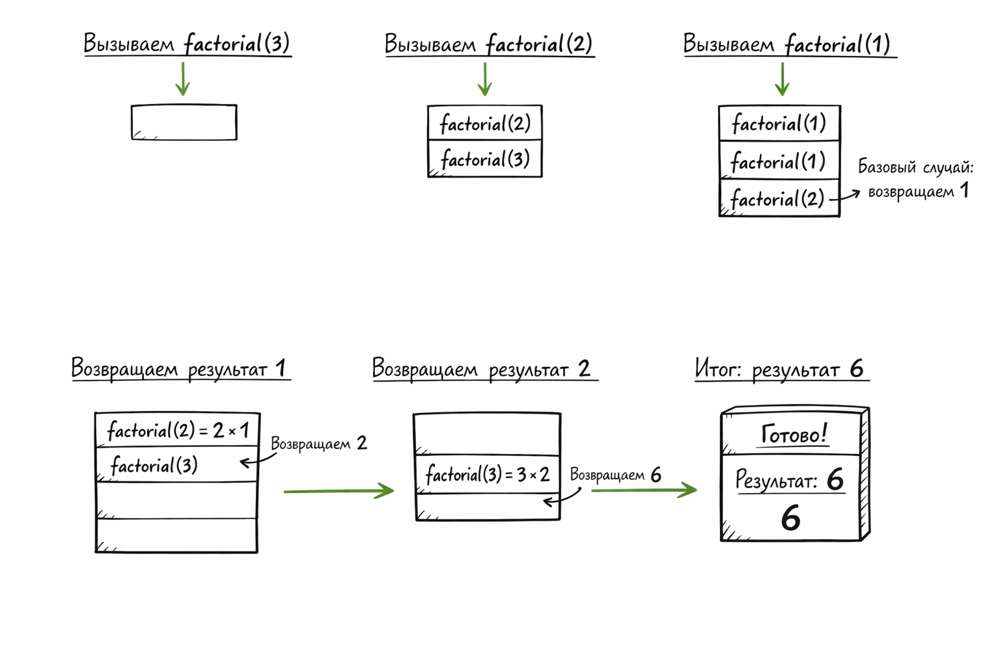

[Оглавление](../README.md) > Глава 3. Рекурсия

# Глава 3. Рекурсия

**Рекурсия** — это когда функция вызывает сама себя для решения задачи.  
Рекурсия полезна, когда задачу проще разбить на одинаковые, меньшие подзадачи.

Рекурсию в программировании **всегда** можно заменить **циклом**. Рекурсия применяется тогда, когда решение становится более понятным.  
Применение рекурсии не ускоряет работу программы: более того, решение с циклами иногда работает быстрее.

> Циклы могут ускорить работу программы. Рекурсия может ускорить работу программиста. 

## Части рекурсивной функции

**Любая рекурсивная функция состоит из двух частей:**
1. **Базовый случай** — условие, при котором функция не вызывает сама себя и возвращает результат.  
**Наличие базового случая в функции обязательно**, так как без него в функции возникнет бесконечный цикл и стек вызовов переполнится.
2. **Рекурсивный случай** — функция вызывает сама себя с «меньшей» задачей.

#### **Пример вычисления факториала с помощью рекурсии** 

**Факториал числа `n`** — это произведение всех чисел от `1` до `n`:
`n! = n * (n-1) * (n-2) * ... * 1`

[Код функции factorial](./factorial.js)
```
function factorial(n) {
  if (n < 0) {
    throw new Error('n должно быть >= 0');
  }
  if (n === 0 || n === 1) {
    return 1;
  }
  return n * factorial(n - 1);
}

console.log(factorial(3)); // 6
console.log(factorial(6)); // 720
console.log(factorial(1)); // 1
```
---

## Стек

**Стек** — структура данных, в которой новые элементы добавляются в начало и извлечение элементов происходит из начала.  
Простейший пример из жизни: стопка тарелок.
- Когда кладёшь тарелку сверху: она на вершине стопки.
- Когда берёшь тарелку: берёшь верхнюю.

В программировании стек используется для **управления вызовами функций**.

## Стек вызовов

В виде стека устроено выполнение программы в компьютере. 

Когда программа выполняет функцию:
1.	Создаётся блок в стеке (фрейм вызова) для этой функции.
2.	Функция выполняется.
3.	Если функция вызывает саму себя (рекурсия), создаётся новый фрейм сверху стека.
4.	Когда функция возвращает значение, её фрейм удаляется из стека.
5.	Управление возвращается к предыдущему фрейму.

При бесконечном рекурсивном цикле стек вызовов быстро заполняется.

#### Например:

```
function factorial(n) {
  if (n <= 1) {
    return 1;
  }
  return n * factorial(n - 1);
}
```

**Пошаговый стек вызовов c рекурсией для factorial(3):**



Рекурсивные вызовы выполняются «снизу вверх»: сначала стек заполняется самыми глубокими вызовами, а после достижения базового случая начинается возврат результатов к верхним уровням.